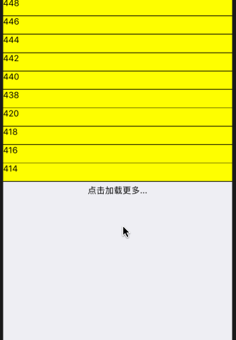

# react-native-loadmore
RN 列表下拉刷新，上拉加载更多
***

## Install

	npm install react-native-loadmore
	
or
	
	yarn add react-native-loadmore	

## Params

|key|type|required|default|desc|version|
|---- |---- |---- |---- |---- |---- |
|renderList|React Element|true||loadmore中显示的列表|
|loadMoreType|String||'click'|下拉加载的形式\['click','scroll']|
|renderList|React Element|true||loadmore中显示的列表|
|onClickLoadMore|function|loadMoreType == 'click'||点击加载更多回调   when loadMoreType = 'click'|
|onLoadMore|function|loadMoreType == 'scroll'||点击加载更多回调   when loadMoreType = 'scroll'|
|onRefresh|function|true||下拉刷新调用|
|isLastPage|bool||false|是否是最后一页，用于是否显示加载更多|
|isLoading|bool|true||是否是获取数据中|
|indicatorText|bool||正在加载 ...|加载中的文本|
|loadMoreBtnText|bool||点击加载更多 ...|点击加载的文本|
|bottomLoadDistance|number||10|底部加载距离差值(为了解决部分手机滑到底部由于距离不够，触发不了加载事件)|^0.2.5|
|scrollViewStyle|style||||^0.2.6|